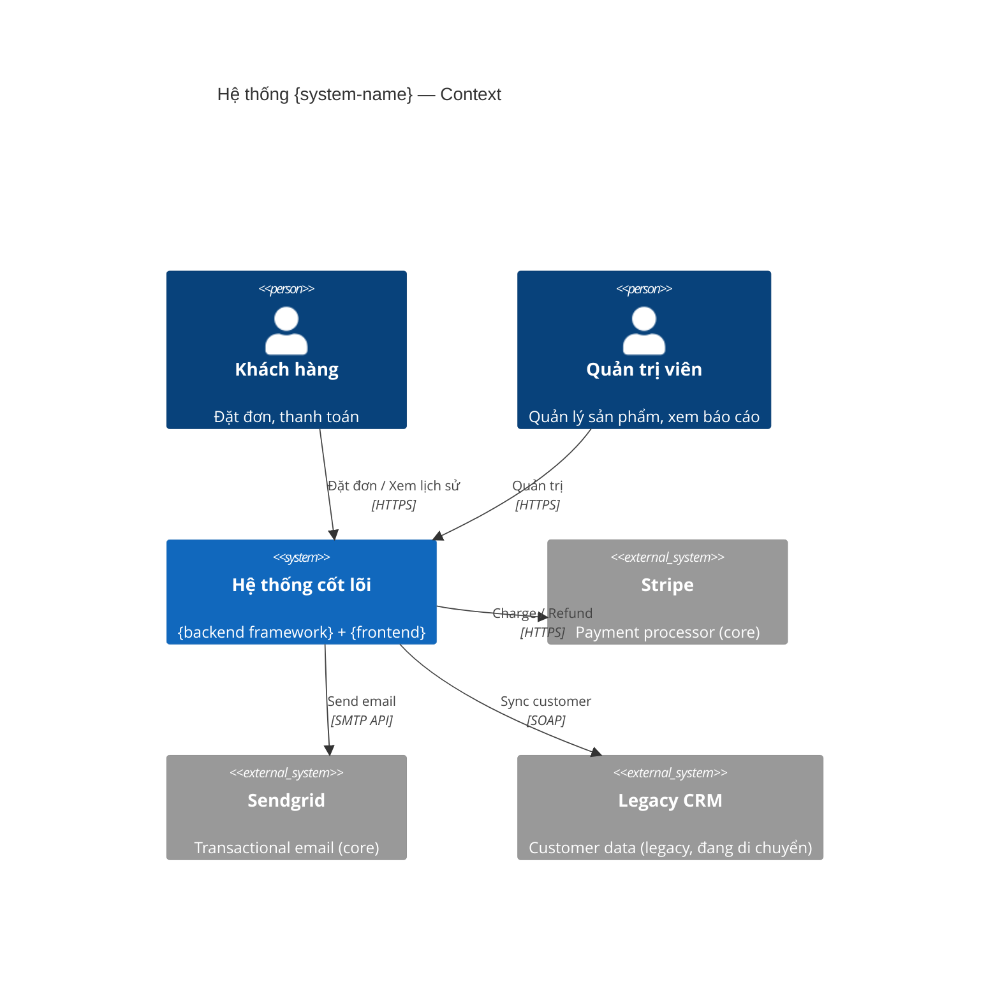
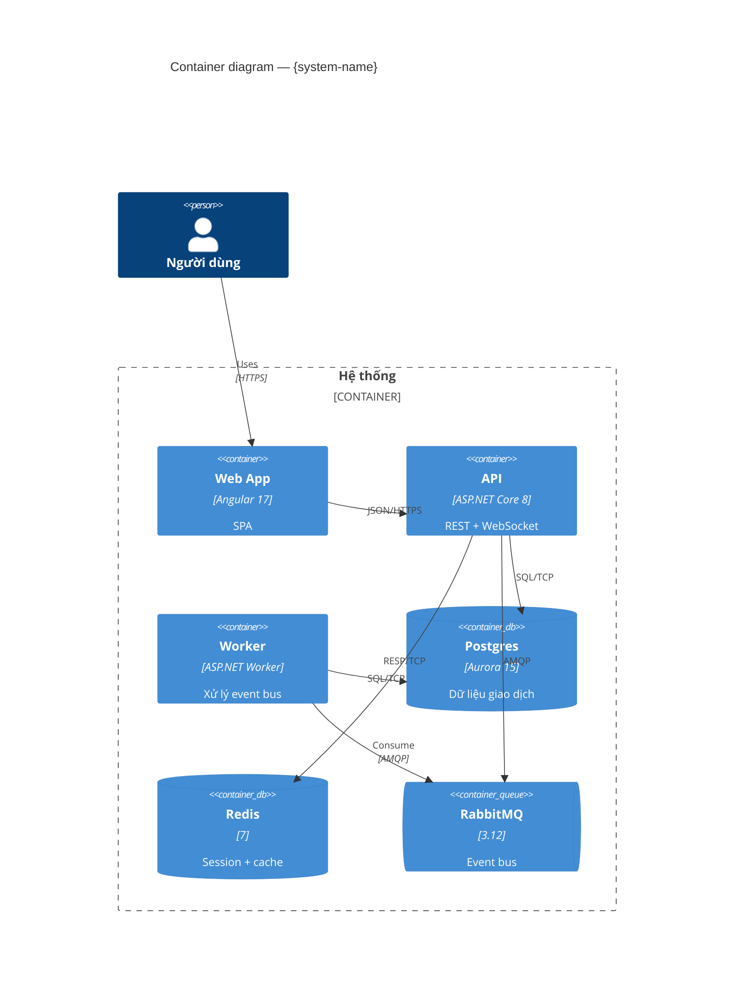
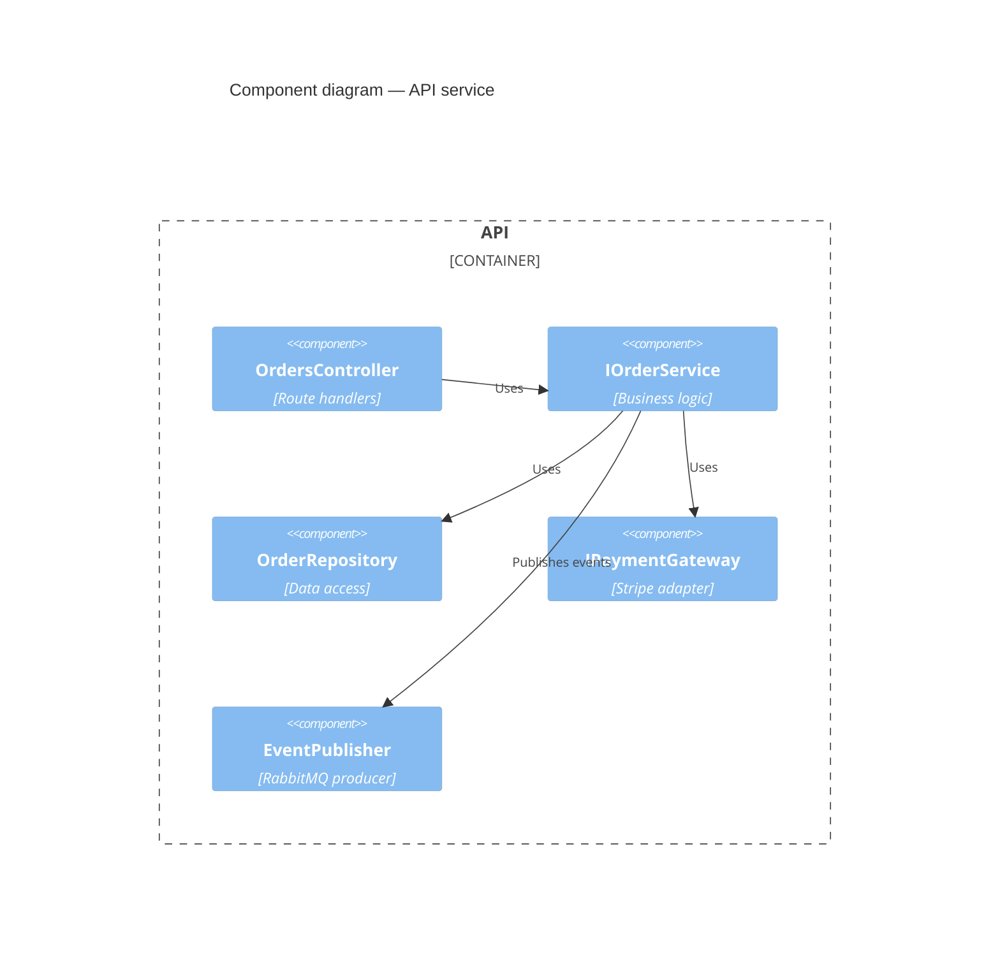
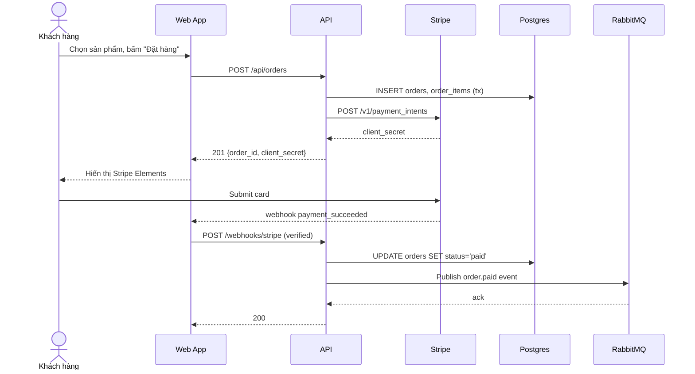

# Phase 6 — Architecture Reconstruction

**Purpose**: Generate C4+ architecture artifacts (Context, Containers, Components, ER, Sequences, Integrations), augmented by Interview Round 3 (NFR, domain boundaries, classification).

**Pre**: Gate A confirmed, features.json on disk
**Tokens**: ~15K (6 artifacts × LLM synthesis + interview)
**Gate**: Gate B (after 6b)

---

## Step 6.0 — Entry print

```
Print: "▶️ Starting Phase 6: Architecture Reconstruction"
```

## § 6a — Generate C4 diagrams from code (deterministic draft + LLM polish)

### 6a.0 Entry print

```
Print: "▶️ 6a: Generating 6 architecture artifacts from code-facts"
```

### 6a.1 Dispatch 6 artifact generators in parallel

Each dispatched as a separate `code-intel` agent in ONE message for true parallelism:

```
PARALLEL:
  Agent(subagent_type: code-intel, prompt: "artifact=context-diagram")
  Agent(subagent_type: code-intel, prompt: "artifact=container-diagram")
  Agent(subagent_type: code-intel, prompt: "artifact=component-diagrams")
  Agent(subagent_type: code-intel, prompt: "artifact=er-diagram")
  Agent(subagent_type: code-intel, prompt: "artifact=sequence-diagrams")
  Agent(subagent_type: code-intel, prompt: "artifact=integration-map")
```

### 6a.2 Artifact specs

#### Context diagram (`docs/architecture/context.md` + `context.mmd`)

Mermaid `C4Context`. Sources:
- Internal: services from `code-facts.services`
- External systems: from `code-facts.integrations` where direction=out + `stack-context.md` classification
- Users/actors: from `code-facts.auth_rules` distinct `role:X` values
- Inbound channels: webhooks, public API endpoints



Prose section below diagram narrates: boundary rationale, core vs legacy vs planned classification.

#### Container diagram (`docs/architecture/containers.md` + `containers.mmd`)

Mermaid `C4Container`. Sources:
- Services (from manifests + docker-compose)
- Data stores (from `code-facts.integrations` kind=db/cache + configs)
- Queues (kind=mq-producer/mq-consumer)
- Auth provider (from stack-context.md)



#### Component diagrams (per service) (`docs/architecture/components-{svc}.md` + `.mmd`)

Mermaid `C4Component` using `di_graph` from code-facts:



Prose narrates: public contracts per component, cross-module dependencies, anti-patterns flagged.

#### ER diagram (`docs/architecture/data-model.md` + `erd.mmd`)

Mermaid `erDiagram` from `code-facts.entities[].fields` + relationships. Prefer migration source over ORM model source.

```mermaid
erDiagram
  CUSTOMER ||--o{ ORDER : places
  ORDER ||--|{ ORDER_ITEM : contains
  ORDER }o--|| PAYMENT : settled_by
  CUSTOMER {
    uuid id PK
    varchar email UK "PII encrypted"
    varchar name
    timestamp created_at
  }
  ORDER {
    uuid id PK
    uuid customer_id FK
    decimal total
    varchar status "new|paid|shipped|cancelled"
  }
  ...
```

Accompanying table lists entities + PII fields + state machines.

#### Sequence diagrams — top 5 journeys (`docs/architecture/sequences/{journey}.mmd`)

Journey selection algorithm:
```
score_per_feature = (
  priority_weight(P0=5, P1=3, P2=1) +
  unique_entities_touched * 0.5 +
  cross_service_span * 2 +            # calls external or different service
  status_active_weight(done=1, in-progress=0.7, stubbed=0.3, planned=0)
)
top_5 = sort_desc(features, by=score)[:5]
```

For each journey, trace call graph: route → service methods → repositories → DB + external calls.



#### Integration map (`docs/architecture/integrations.md` + `flowchart.mmd`)

Mermaid `flowchart LR` + table. Aggregates all `code-facts.integrations`.

```
Inbound:
  | Channel        | Source            | Handler          | Auth      |
  | webhook        | Stripe            | StripeWebhookCtl | HMAC-SHA  |
  | REST           | Mobile app        | /api/*           | JWT       |
  | MQ consumer    | order.placed      | OrderWorker      | internal  |

Outbound:
  | Target         | Kind              | Classification  | Config    |
  | Stripe         | http-outbound     | core            | STRIPE_*  |
  | Sendgrid       | http-outbound     | core            | SG_*      |
  | legacy-crm     | http-outbound     | legacy          | LCRM_URL  |
  | new-crm        | -                 | planned         | (none yet)|
```

### 6a.3 Mermaid render validation

For each `.mmd` file, run `mmdc --validate` (or equivalent). On parse error:
- Log to `state.steps["6"].mermaid_errors[]`
- Keep raw `.mmd` for manual fix
- Still proceed — rendering can retry later

### 6a.4 Exit 6a

```
Print: "✅ 6a: 6 architecture artifacts generated.
        - context.mmd
        - containers.mmd
        - {N} components-*.mmd
        - erd.mmd
        - sequences/{5} .mmd
        - integrations flowchart.mmd
        Mermaid errors: {count}
        ▶️ Next: 6b Interview R3"
```

---

## § 6b — Interview Round 3 (Architecture + NFR + Domain)

### 6b.0 Entry print

```
Print: "▶️ 4b: Collect NFR + ADR context (MC-5 forward-looking)"
```

### 4b.1 Batched questions (MC-5 forward context)

Use AskUserQuestion with multi-question payload. Each batch triggered only if relevant context isn't already in `state.config.interview_context` (e.g. MC-4 may have already captured domain boundaries).

**Batch 1 — NFR** (up to 4 questions; skip if already captured):
1. "SLA p95 latency cho API chính (ví dụ: 200ms / 500ms / 1s)?"
2. "Throughput kỳ vọng (requests/second cao điểm)?"
3. "Uptime target (99.9% / 99.95% / 99.99%)?"
4. "RPO/RTO yêu cầu (dữ liệu mất bao lâu là chấp nhận được, thời gian khôi phục)?"

**Batch 2 — Data classification + security** (up to 4 questions):
1. "Bảng nào chứa PII (CCCD, email, phone, address)?"
2. "Bảng nào chứa dữ liệu tài chính (payment, invoice)?"
3. "Dữ liệu nhạy cảm có đang encrypt at-rest không?"
4. "Có audit log cho các state-transition quan trọng?"

**Batch 3 — Deployment + ADR + tech debt** (up to 4 questions):
1. "Số lượng môi trường (dev/stg/prod), cấu hình HA?"
2. "Có kiến trúc quyết định (ADR) nào quan trọng cần ghi lại? (Ví dụ: chọn Postgres vs MongoDB, CQRS vs simple CRUD)"
3. "Tech debt nào cần flag trong docs (để dev team ưu tiên xử lý)?"
4. "Nothing more to add (skip remaining)"

> Domain boundaries (previously Batch 1 in old R3) are now captured in MC-4 directly after diagrams.
> External classification (previously Batch 4) is captured in MC-4 as integration classification.

### 6b.2 Write arch-context.md

```markdown
# Architecture Context — User-provided claims (Round 3)

## Domain Boundaries
- Core domain: {Orders, Payment} — competitive differentiator
- Supporting: {Notifications, Reporting}
- Generic: {Auth, User management}
_source: user interview R3_

## NFR Targets
| Area        | Target                    | Source              |
|-------------|---------------------------|---------------------|
| Latency p95 | 300ms API, 1s page load   | user interview R3   |
| Throughput  | 500 rps peak              | user interview R3   |
| Uptime      | 99.95%                    | user interview R3   |
| RPO / RTO   | 5 min / 1 hour            | user interview R3   |

## Data Classification
| Table       | Classification | Encryption | Audit |
|-------------|----------------|------------|-------|
| customers   | PII + contact  | AES at-rest| yes   |
| orders      | financial      | -          | yes   |
| payments    | financial + PCI| tokenized  | yes   |
| products    | public         | -          | no    |

## Deployment
- Envs: dev / stg / prod
- Prod: us-east-1 primary, us-west-2 DR
- HA: multi-AZ on all stateful
- CI/CD: GitHub Actions → ECS

## ADR Candidates (generated from responses)
- ADR-001: Chọn CQRS cho module Orders (perf yêu cầu)
- ADR-002: Postgres > MongoDB (ACID cho payment)
- ADR-003: Redis session store (giảm tải DB auth)

## Tech Debt Flags
- legacy-crm integration sẽ bị deprecate Q4/2026 — mọi code mới phải dùng new-crm interface
- Worker service đang single-tenant, cần refactor cho multi-tenant Q2
```

### 6b.3 Generate ADRs (optional, conditional)

```
IF len(adr_candidates) >= 1:
  AskUserQuestion (max 3):
    1. "✅ Viết ADR files (cần ≥ 3 ADR cho generate-docs Route A scoring 5/5)"
    2. "⏭️ Bỏ qua ADR (bridge Route A sẽ 4/5 — vẫn dùng được)"
    3. "✏️ Sửa/thêm ADR candidates"

  IF option 1:
    FOR each adr_candidate:
      Agent(subagent_type: code-intel,
            prompt: "task=write-adr, id={adr_id}, topic={topic}")
      → writes docs/adr/ADR-{id}-{topic-slug}.md (MADR or Nygard format)
```

### 4b.4 MC-5 Micro-checkpoint (arch-brief ready)

See [_micro-checkpoint.md](_micro-checkpoint.md).

```
Pre-check: verify state.steps["2"].completed_at != null (Phase 2 done)

LOOP:
  iter = state.steps["4"].mini_gate.iterations_5
  IF iter >= 2:
    Force 2-option (confirm | cancel)

  Display: arch-context.md + list of generated diagrams + list of ADRs
  AskUserQuestion (max 4):
    1. "✅ Xác nhận — tiếp tục 6c merge"
    2. "✏️ Sửa arch-context (thêm NFR / bỏ ADR / ...)"
    3. "🔄 Re-generate diagram(s) specific"
    4. "❌ Hủy"

  IF Xác nhận → BREAK
  IF Sửa → collect deltas, rewrite arch-context.md, iter += 1
  IF Re-generate → re-dispatch specific 6a artifact(s)
  IF Hủy → cleanup, STOP

state.steps["gate-b"].confirmed = true
```

---

## § 6c — Merge into arch-brief.md + bridge files

### 6c.0 Entry print

```
Print: "▶️ 6c: Merging architecture into brief + bridge files"
```

### 6c.1 Dispatch arch-brief writer

```
Agent(subagent_type: code-intel, prompt: "task=write-arch-brief")
```

Writes `docs/intel/arch-brief.md` — the canonical architecture summary (reusable by generate-docs):
- Executive summary
- System context
- Logical architecture (containers + components)
- Data architecture (ER + classification)
- Integration architecture
- Deployment architecture
- NFR targets
- Cross-cutting: security, observability, error handling
- Known debt + evolution plan
- Every claim has `source:` (code-facts / stack-context / arch-context)

### 6c.2 Dispatch code-brief writer

```
Agent(subagent_type: code-intel, prompt: "task=write-code-brief")
```

Writes `docs/intel/code-brief.md` — the **feature-centric** brief, mirror of `doc-brief.md` from `from-doc`. Sections:
- §1 System name + purpose
- §2 Business modules → features mapping
- §3 Actors (derived from auth roles + interview)
- §4 Screen inventory (from FE routes + i18n titles)
- §5 Business rules (derived from validators + guards + DB constraints + interview)
- §6 Entities + relationships
- §7 UI screens
- §8 Integrations
- §9 NFRs
- §10 Security notes
- §11 Ambiguities (blocking gaps from low-confidence features)
- §12 Out-of-scope (deferred/planned features)
- §13 Inferences / insights

Header frontmatter:
```yaml
---
system-name: {from interview or detected}
source-type: code-reverse-engineered
generated-at: {ISO}
sources:
  - docs/intel/code-facts.json
  - docs/intel/features.json
  - docs/intel/status-evidence.json
  - docs/intel/stack-context.md
  - docs/intel/arch-context.md
feature-count: {N}
rules-count: {N}
entities-count: {N}
ambiguities: {N}
---
```

### 6c.3 Write bridge files (CP-6)

Generate canonical locations for generate-docs Route A:

```
bridge_files = {
  "docs/README.md":              compose_readme(code-brief §1, arch-brief executive, features summary),
  "docs/ARCHITECTURE.md":        concat([arch-brief, all architecture/*.md]) with TOC,
  "docs/business-flows.md":      aggregate sequence narratives + top 5 journey prose,
  "docs/data-model.md":          copy architecture/data-model.md (or symlink),
  "docs/security-overview.md":   compose_security(auth-rules + PII + NFR security + interview),
  # adr/*.md already written in 6b.3 if option 1 chosen
  "docs/features/{id}/feature-brief.md":  # written in Phase 7
}

FOR each bridge_file:
  Write atomic
  Register in state.artifacts
```

**Monorepo**: Write per-service bridge files at `{svc.path}/docs/`. Root-level only gets `docs/architecture/context.md`, `containers.md`, `deployment.md`, `feature-map-aggregate.yaml`.

### 6c.4 Exit print

```
Print: "✅ Phase 6 complete.
        Architecture:
          - context, containers, {N} components, ER, {5} sequences, integration map
          - ADRs: {N}
          - arch-brief.md, code-brief.md written
        Bridge files:
          - docs/README.md, ARCHITECTURE.md, business-flows.md, data-model.md, security-overview.md
        ▶️ Next: Phase 7 Scaffold + Feature Briefs"

state.steps["6"].completed_at = now
state.current_step = "7"
Flush state
```
