# Diagram Template Library — Mermaid (default) + SVG hero (premium)

Reusable prompt chunk — 12 templates diagram theo QĐ 292/2025 + NĐ 45/2026 Đ13.
Ngoài ra 3 SVG hero templates cho diagram "trang bìa" cần thẩm mỹ cao.

**Usage**: `@Notepads mermaid-templates` khi Phase 3 generate `diagrams.*` block.

**Key concept**: content-data.json có top-level `diagrams` block. etc-platform MCP
`export` auto-detect mỗi entry theo shape:
- **string** → Mermaid source, render qua `mmdc` CLI
- **object có `template`** → SVG hero Jinja2, render qua Chromium

PNG output vào `out/diagrams/{key}.png` — templates docx tự embed.

```jsonc
{
  "diagrams": {
    // Dạng A — Mermaid (default cho 90% diagrams)
    "logical_diagram": "flowchart TB\n  Web --> API\n  API --> DB",
    "data_diagram":    "erDiagram\n  ...",

    // Dạng B — SVG hero (dùng khi project fit template)
    "architecture_diagram": {
      "template": "kien-truc-4-lop",
      "data":     { /* schema từng template — xem section dưới */ }
    }
  },
  "architecture": {
    "architecture_diagram": "architecture_diagram.png",  // filename ref, engine điền image
    "logical_diagram":      "logical_diagram.png"
  }
}
```

---

## ⚠ Government mandate — diagram bắt buộc

| Doc type | Min diagrams | Source citation |
|---|---|---|
| **TKKT** | 6 | QĐ 292/2025 Khung KT CPĐT 4.0 |
| **TKCS** | 2 | NĐ 45/2026 Điều 13 khoản 6 |
| **TKCT** | 4 + per-module | Standard design practice |

Tổng tối thiểu 12 diagrams cho full pipeline. KHÔNG được bỏ qua — thẩm định TKCS/TKKT sẽ reject nếu thiếu.

---

## TKKT — 6 diagrams

### 1. `architecture_diagram` (L0 context)

Vẽ hệ thống tổng thể + external actors. Source từ `architecture.external_integrations[]` + roles_mapping.

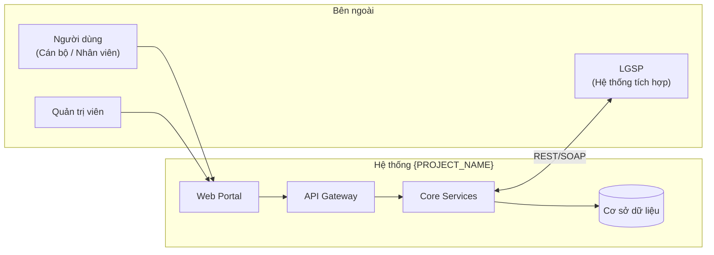

### 2. `logical_diagram` (L1 components)

Vẽ components + interactions. Source từ `architecture.components[]`.

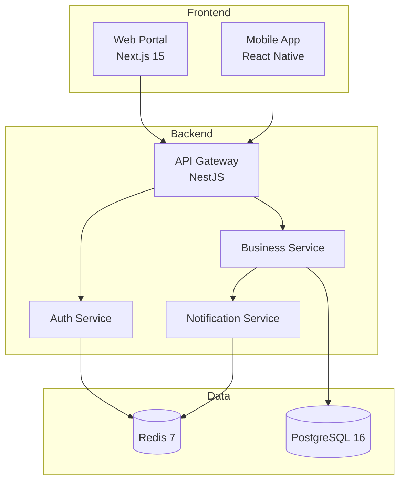

### 3. `data_diagram` (ERD tổng thể)

Source từ `architecture.data_entities[]`. Chỉ show entity + key fields + relations.

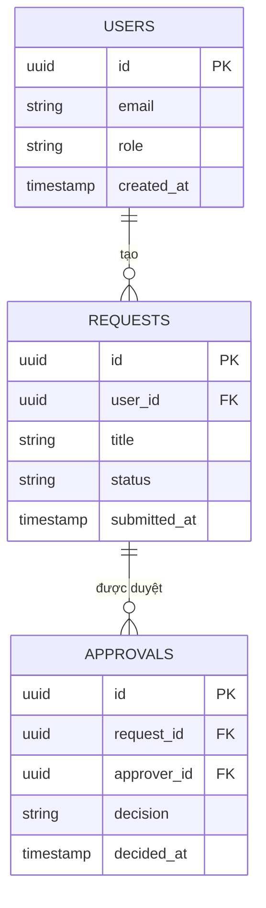

### 4. `integration_diagram` (sequence)

Source từ `architecture.external_integrations[]` + `architecture.apis[]`.

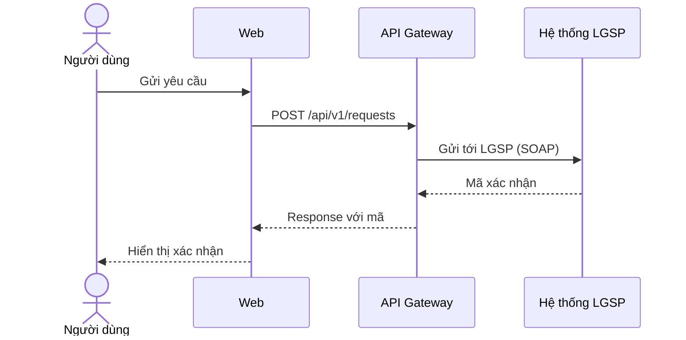

### 5. `deployment_diagram`

Source từ `architecture.containers[]` + `architecture.environments[]`.

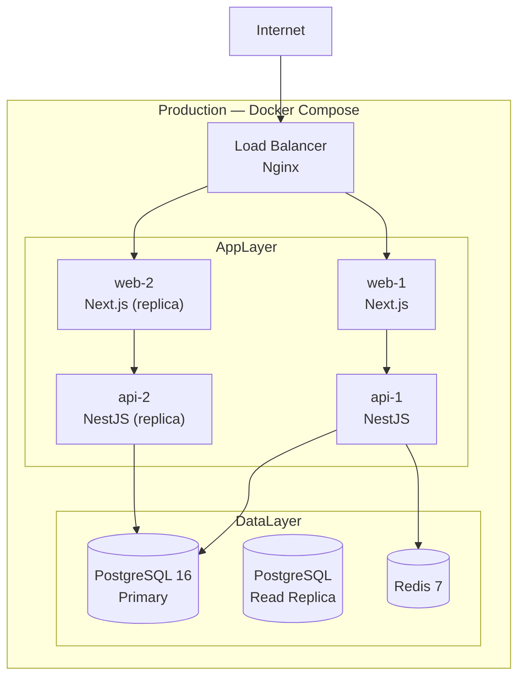

### 6. `security_diagram`

Auth flow + trust boundaries.

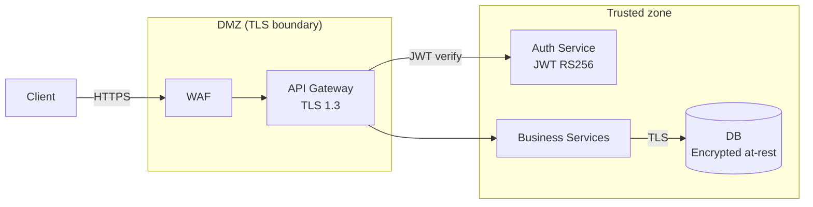

---

## TKCS — 2 diagrams (NĐ 45/2026 Đ13 khoản 6)

### 7. `tkcs_architecture_diagram`

Reuse TKKT `architecture_diagram` hoặc vẽ bản simplified cho TKCS context.

### 8. `tkcs_data_model_diagram`

Reuse TKKT `data_diagram` hoặc bản đơn giản hơn (chỉ top 5-7 entities chính).

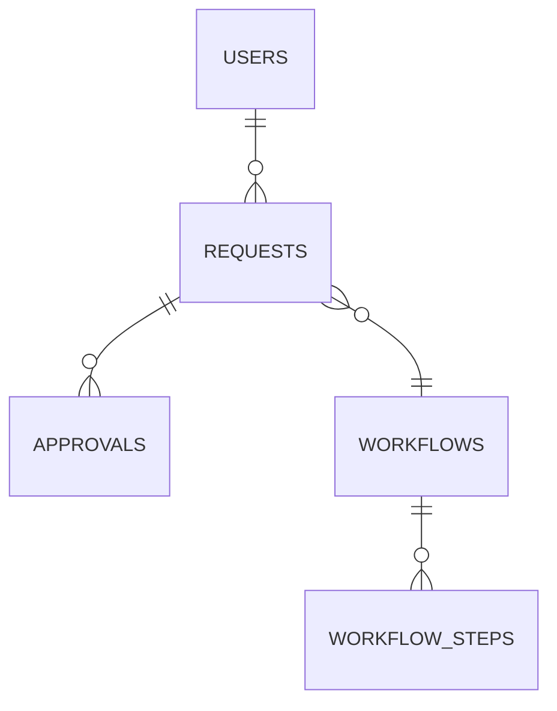

---

## TKCT — 4 core + per-module

### 9. `tkct_architecture_overview_diagram`

Reuse TKKT logical_diagram hoặc detailed hơn.

### 10. `tkct_db_erd_diagram`

ERD chi tiết với ĐỦ columns (khác TKCS chỉ show entity names).

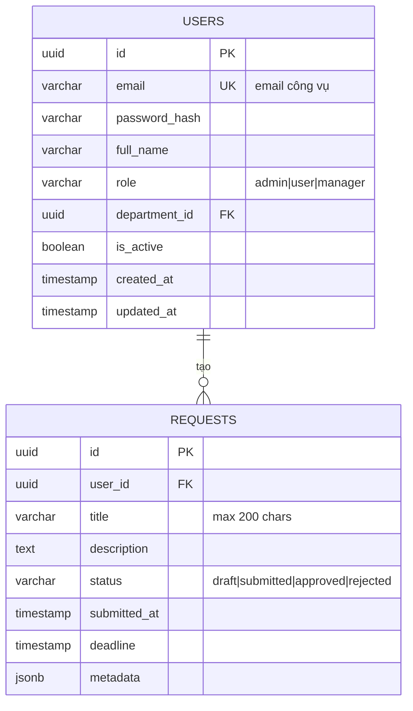

### 11. `tkct_ui_layout_diagram`

Information architecture / screen map.

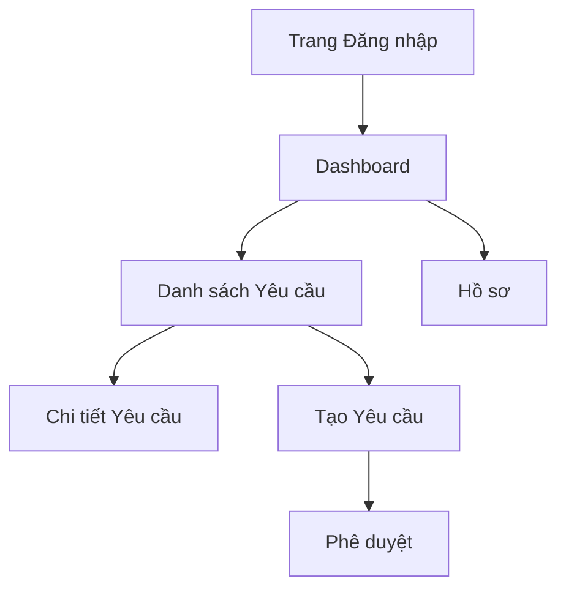

### 12. `tkct_integration_diagram`

Chi tiết integration hơn TKKT — show request/response payload examples.

### Per-module `flow_diagram` (trong `tkct.modules[].flow_diagram`)

1 flowchart mô tả business flow của module. Ví dụ module "Tác nghiệp":

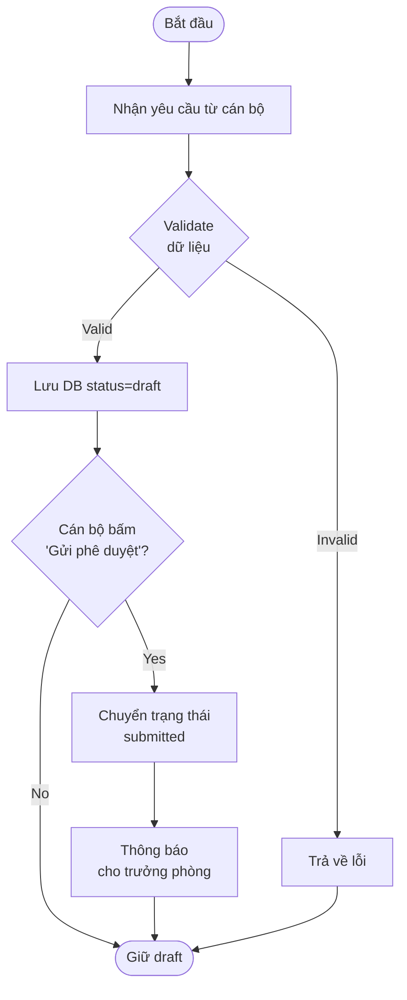

---

## Rules khi generate Mermaid

1. **Labels tiếng Việt** cho business entities (Người dùng, Yêu cầu) — giữ tiếng Anh cho technical terms (API Gateway, PostgreSQL)
2. **Không vượt quá 20 nodes** — diagram lớn hơn → split thành L1/L2/L3
3. **Không hardcode version** — dùng từ `architecture.tech_stack[].version`, fallback "[CẦN BỔ SUNG]"
4. **Colors**: chỉ dùng khi cần phân tầng (DMZ/Trusted) — Mermaid default đủ cho document
5. **Arrows có label** khi show interaction — `A -->|"POST /api"| B` không chỉ `A --> B`
6. **Subgraphs** để group related components — giúp đọc dễ

---

## Fallback khi intel thiếu data

Nếu Path A và `doc-intel` không có components/entities/containers:

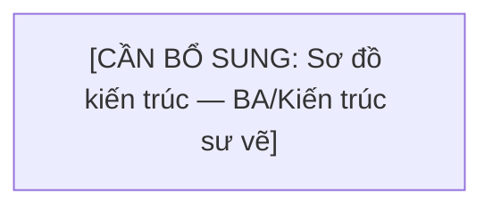

Diagram placeholder vẫn render PNG có text để thẩm định thấy "đã có chỗ", BA fill sau.

---

## Template rendering check

Sau khi Mermaid source vào `content-data.diagrams.*`, verify:

```bash
# Container render Mermaid khi export
MSYS_NO_PATHCONV=1 docker exec etc-platform \
  ls /data/{slug}/out/diagrams/
# Expect: 12+ PNG files
```

Nếu thiếu PNG → source Mermaid syntax sai. Debug:
```bash
docker exec etc-platform \
  bash -c "echo 'flowchart LR\n A-->B' | mmdc -i /dev/stdin -o /tmp/test.png"
```

---

# SVG hero templates (Tier 1 — premium)

Dùng cho 3 diagram "trang bìa" cần thẩm mỹ cao. MCP engine render Jinja2 → SVG →
Chromium headless → PNG pixel-perfect (device_scale_factor=2.0). **Chỉ dùng khi
project thực sự fit template** — nếu không, giữ Mermaid an toàn hơn.

## Bảng routing

| Mandated key | Khi nào dùng SVG hero | Template |
|---|---|---|
| `architecture_diagram` | Dự án liên quan Chính phủ số / CQĐT, diễn giải kiến trúc 4 lớp CPĐT 4.0 | `kien-truc-4-lop` |
| `integration_diagram` | Dự án tích hợp qua NDXP/LGSP, muốn show hub-spoke tổng thể | `ndxp-hub-spoke` |
| `tkct_integration_diagram` (khi DVC) | Hệ thống DVCTT toàn trình, cần swimlane 5 actors chuẩn | `swimlane-workflow` |

Các key còn lại (`logical`, `data`, `deployment`, `security`, `tkct_*`, per-module)
→ **LUÔN Mermaid**, không có SVG hero tương ứng.

## Template #T1 — `kien-truc-4-lop`

Kiến trúc tổng thể 4 lớp theo Khung CPĐT 4.0 (QĐ 292/QĐ-BKHCN).

**Data schema**:
```jsonc
{
  "template": "kien-truc-4-lop",
  "data": {
    "title":    "KIẾN TRÚC TỔNG THỂ <Tên hệ thống>",
    "subtitle": "(Căn cứ QĐ 292/QĐ-BKHCN — 25/03/2025)",
    "actors": [
      { "label": "Công dân",        "icon": "person" },
      { "label": "Doanh nghiệp",    "icon": "person" },
      { "label": "Cán bộ, CCVC",    "icon": "person" }
    ],
    "layers": [
      {
        "number":      4,
        "name_vi":     "Kênh tương tác",
        "name_en":     "Interaction Channels",
        "tint":        "#BBDEFB",
        "label_color": "#0D3B66",
        "items": [
          { "label": "Cổng DVC Quốc gia", "icon": "portal",    "highlighted": false },
          { "label": "VNeID App",         "icon": "mobile",    "highlighted": false }
        ]
      },
      { "number": 3, "name_vi": "Ứng dụng & Dịch vụ",        "name_en": "Applications",    "tint": "#E8F5E9", "label_color": "#2E7D32", "items": [...] },
      { "number": 2, "name_vi": "Nền tảng tích hợp, chia sẻ", "name_en": "Integration",     "tint": "#FFF3CD", "label_color": "#B8860B", "items": [...] },
      { "number": 1, "name_vi": "Hạ tầng & Dữ liệu",          "name_en": "Infrastructure",  "tint": "#FFEBEE", "label_color": "#C1272D", "items": [...] }
    ],
    "footer": {
      "caption":      "Hình 2.1: Kiến trúc tổng thể 4 lớp",
      "source":       "Nguồn: QĐ 292/QĐ-BKHCN ngày 25/03/2025"
    }
  }
}
```

**Icons hỗ trợ**: `portal`, `mobile`, `dashboard`, `person`, `building`, `gear`,
`database`, `cloud`, `shield`, `network`.

## Template #T2 — `ndxp-hub-spoke`

Hub (NDXP) + 4 nhóm spoke (top/right/bottom/left).

**Data schema**:
```jsonc
{
  "template": "ndxp-hub-spoke",
  "data": {
    "title":    "MÔ HÌNH KẾT NỐI NDXP",
    "subtitle": "Theo QĐ 17/2025/QĐ-TTg và NĐ 47/2020/NĐ-CP",
    "hub": {
      "name":         "NDXP",
      "sublabel":     "Nền tảng tích hợp, chia sẻ dữ liệu quốc gia",
      "english_name": "National Data Exchange Platform",
      "operator":     "Bộ KH&CN / Cục CĐS"
    },
    "groups": {
      "top":    { "header": "CƠ SỞ DỮ LIỆU QUỐC GIA", "count_subtitle": "(5 hệ thống chính)", "arrow_label": "Khai thác CSDLQG", "boxes": [ {"label":"CSDLQG Dân cư","sublabel":"(Bộ Công an)","icon":"cylinder"}, ... ], "ghost_box": null },
      "right":  { "header": "BỘ / NGÀNH",             "count_subtitle": "(25 bộ)",            "arrow_label": "Tích hợp Bộ/Ngành", "boxes": [...], "ghost_box": {"wrap_lines":["...","..."]} },
      "bottom": { "header": "TỈNH / THÀNH",           "count_subtitle": "(63 tỉnh)",          "arrow_label": "Tích hợp Tỉnh",     "boxes": [...], "ghost_box": null },
      "left":   { "header": "DOANH NGHIỆP / BÊN NGOÀI","count_subtitle": "(SLA)",              "arrow_label": "Cung cấp DV",        "boxes": [...], "ghost_box": null }
    },
    "footer": { "caption": "...", "source": "..." }
  }
}
```

**Icons nhóm**: `cylinder` (CSDL), `building` (bộ/tỉnh), `company` (doanh nghiệp).

## Template #T3 — `swimlane-workflow`

5 lanes chuẩn DVC trực tuyến toàn trình. Arrows/decision đã hardcode — chỉ
parameterize text.

**Data schema**:
```jsonc
{
  "template": "swimlane-workflow",
  "data": {
    "title":    "LUỒNG NGHIỆP VỤ XỬ LÝ HỒ SƠ DVC TRỰC TUYẾN TOÀN TRÌNH",
    "subtitle": "Theo NĐ 42/2022/NĐ-CP và Đề án 06 (QĐ 06/QĐ-TTg)",
    "legend_items": [
      { "label": "Công dân / DN", "swatch_type": "rect",          "fill": "#E8F5E9", "stroke": "#2E7D32" },
      { "label": "Điểm quyết định","swatch_type": "diamond",       "fill": "#FFF9C4", "stroke": "#0D3B66" },
      { "label": "Luồng từ chối",  "swatch_type": "dashed_arrow" }
    ],
    "lanes": [
      {
        "actor_name_lines": ["CÔNG DÂN /", "DOANH NGHIỆP"],
        "icon": "person", "fill": "#E8F5E9", "stroke": "#2E7D32",
        "activities": [
          { "label": "Truy cập Cổng DVCQG / VNeID" },
          { "label": "Ký số hồ sơ bằng VNeID" },
          { "label": "Nhận kết quả điện tử" }
        ]
      },
      // ...4 lanes còn lại: "CỔNG DVCQG / VNeID", "LGSP BỘ/TỈNH", "NDXP + CSDLQG", "CÁN BỘ XỬ LÝ"
    ],
    "decisions": [
      { "lane": 2, "label": "Đủ điều kiện?" },
      { "lane": 5, "label": "Hồ sơ hợp lệ?" }
    ],
    "arrow_labels": {
      "citizen_to_portal": "Đăng nhập",
      "portal_reject":     "Từ chối",
      "portal_to_lgsp":    "Hồ sơ đã xác thực",
      // ... 15 labels flat strings — xem T3-sample.json đầy đủ
    },
    "caption":       "Hình 2.3: Sơ đồ swimlane xử lý hồ sơ DVCTT toàn trình",
    "source_footer": "Nguồn: NĐ 42/2022/NĐ-CP; QĐ 06/QĐ-TTg (Đề án 06)."
  }
}
```

**Lưu ý**: lanes[] PHẢI đủ 5 lanes theo thứ tự chuẩn — số lane/geometry là
hardcoded trong template.

## Sample data đầy đủ

Xem trong repo etc-platform:
- `examples/diagrams-data/T1-sample.json`
- `examples/diagrams-data/T2-sample.json`
- `examples/diagrams-data/T3-sample.json`

## Validation

- Field thiếu → Jinja2 `StrictUndefined` raise — export fail tại step diagram
- Test nhanh: copy sample T1/T2/T3, sửa nội dung theo project, fill vào
  `diagrams.{key}`, gọi `validate` + `export`, check response
  `diagrams.rendered[]` có đúng key không
